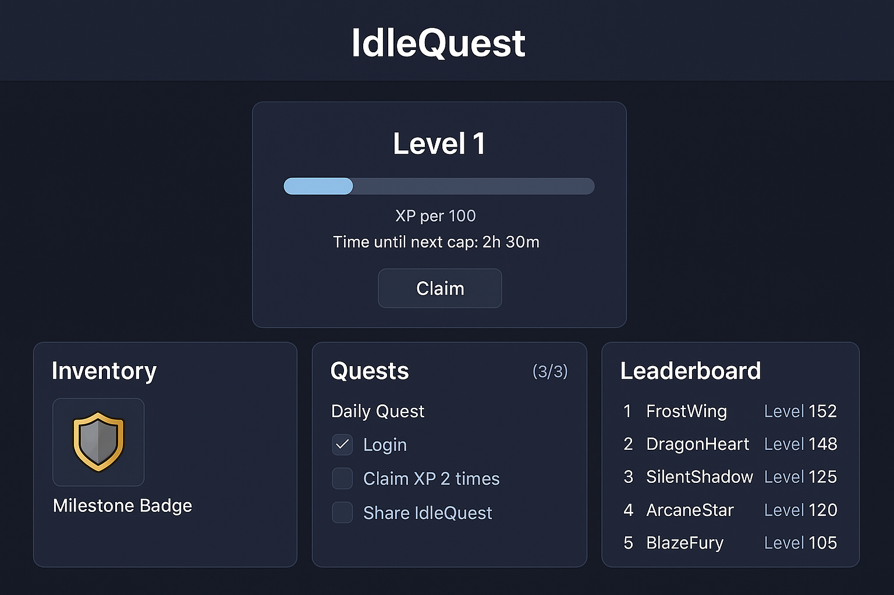

# IdleQuest – Idle / Incremental Game with NFT Milestones

> **Testnet vApp Proposal** for iyunq/testnet-vapps

## 🎯 Overview
IdleQuest is a blockchain-based idle/incremental game where players automatically level up and receive unique NFT badges each time they reach a milestone level. This vApp demonstrates on-chain progress tracking, NFT reward minting, and gamified engagement on the SoundnessLabs testnet without requiring players to stay online continuously.

## ✨ Key Features
- **Passive XP accrual:** XP increases even when players are offline.
- **Level milestones:** Mint unique NFT badges at Lv5/10/20/30/50/75/100.
- **Trait-based NFTs:** Each badge has random attributes and a small XP bonus.
- **Daily quests:** Lightweight tasks to boost XP and improve retention.
- **Leaderboard:** Public ranking of top players and milestone achievers.

## 🛠 Architecture
- **Smart Contracts:**  
  - `PlayerCore.sol` stores player progress, claim XP, and handles level ups.  
  - `MilestoneNFT.sol` is an ERC-721 contract for milestone NFTs with generative traits.  
  - `BoostManager` (optional) for managing temporary boosts.  

- **Data Flow:**  
  1. User clicks *Claim* on the frontend → `PlayerCore.claim()`.  
  2. Contract calculates passive XP since last claim and updates level.  
  3. When a milestone is reached → calls `MilestoneNFT.mintMilestone()`.  
  4. Frontend listens for `MilestoneReached` events to update the UI.  

- **Stack:** Solidity ^0.8.24 (Hardhat/Foundry), OpenZeppelin Contracts, Next.js + wagmi + RainbowKit.

## 🔒 Security & Anti-Abuse
- Cap passive XP accrual (e.g., 72h).
- Cooldown between claims.
- Simple commit–reveal for randomness in NFT traits.
- Role-based access control for parameters and admin actions.

## 🚀 Roadmap (4 weeks)
1. Core contracts & tests.
2. Frontend dashboard + wallet connect.
3. NFT renderer + trait logic.
4. Daily quests + leaderboard + documentation.

## 📊 Success Metrics
- D1/D7 claim retention.
- % of players reaching Lv10 / Lv30.
- Average NFTs per user.
- Median gas per claim.

## 🔗 Links
dApp repository / demo will follow after testnet approval.

---

- GitHub: iyunq
- Discord: squad0x
